# Local API for Ranking System - Architecture and Implementation

[](README.md)
[](README.en.md)

## 🎯 Solution Overview

The idea consists of creating a **local REST API** that runs on a dedicated home computer, serving as a central server for the game ranking system. This allows multiple devices on the local network to access and synchronize data, maintaining scalability without depending on external services.

### Main Benefits
- ✅ **Total Privacy**: Data stays 100% local
- ✅ **No Hosting Costs**: No monthly fees or charges
- ✅ **Performance**: Low latency on local network
- ✅ **Total Control**: You manage everything
- ✅ **Scalable**: Architecture allows future growth
- ✅ **Offline-First**: Works even without internet

---

## 🏗️ System Architecture

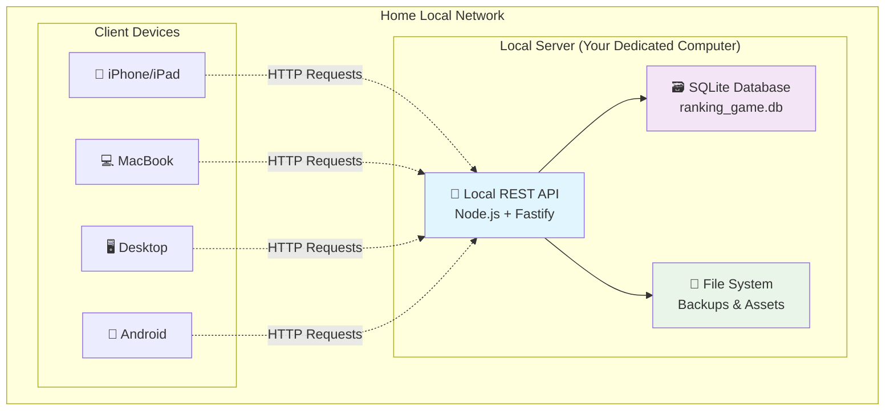

---

## 🔄 Current Data Migration

### Current State vs Future

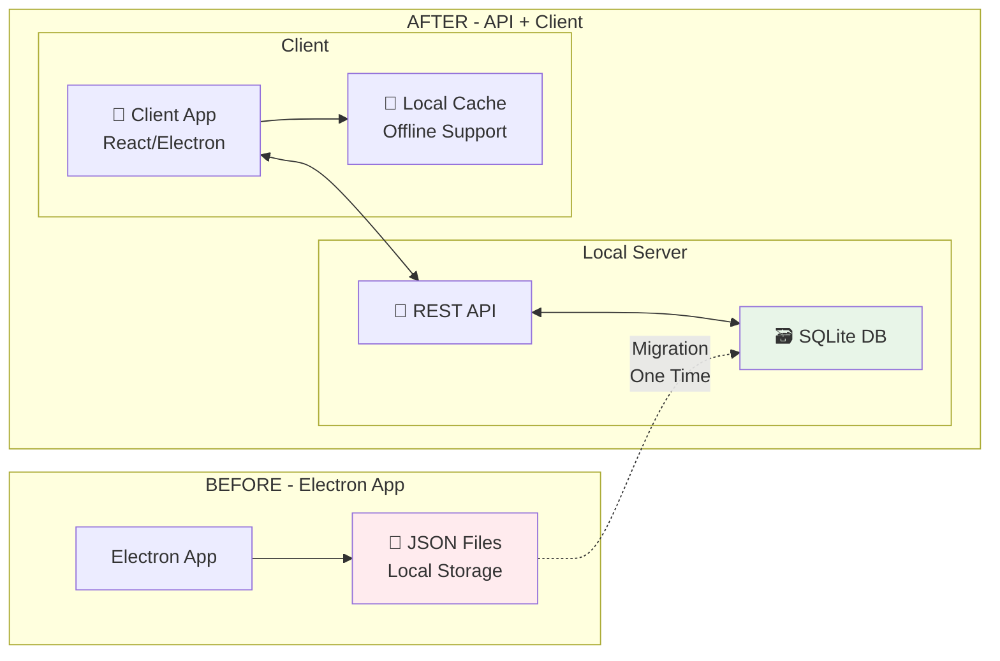

---

## 🗄️ SQLite Database Structure

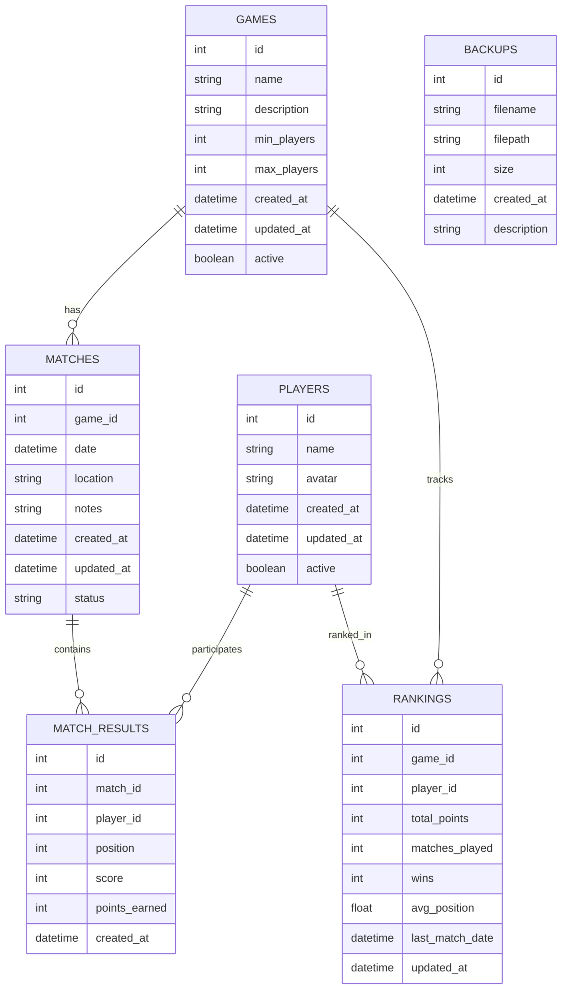

---

## 🛠️ Technology Stack

### Backend (Local API)
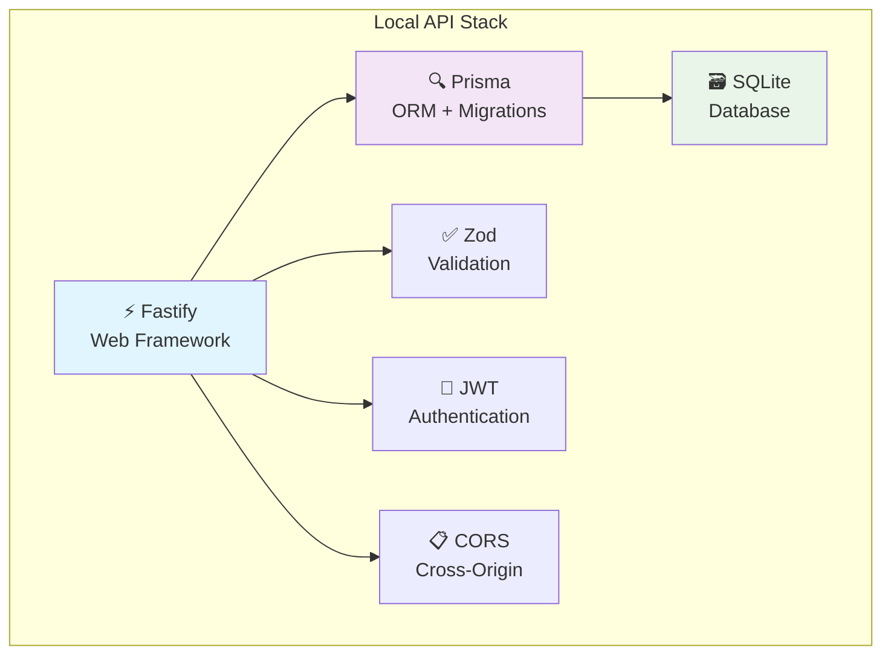

### Frontend (Clients)
- **Electron App** (Desktop) - Maintains current compatibility
- **PWA/Web App** (Mobile/Tablet) - Browser access
- **React + TypeScript** - Common base for both

---

## 🌐 API Endpoints

### Route Structure

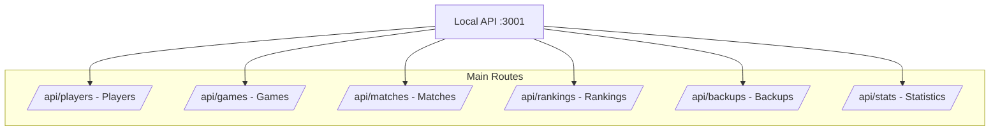

### Endpoint Examples

```typescript
// GET /api/players - List players
// POST /api/players - Create player
// PUT /api/players/:id - Update player
// DELETE /api/players/:id - Remove player

// GET /api/matches - List matches
// POST /api/matches - Register new match
// GET /api/matches/:id - Match details

// GET /api/rankings/:gameId - Ranking by game
// GET /api/stats/summary - General statistics
```

---

## 🔄 Operation Flow

### Scenario: Register New Match

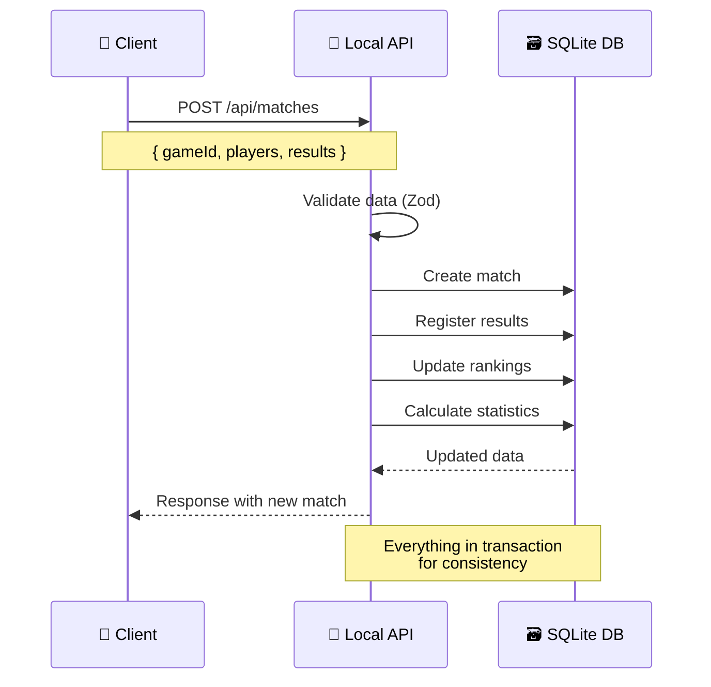

### Multi-Device Synchronization

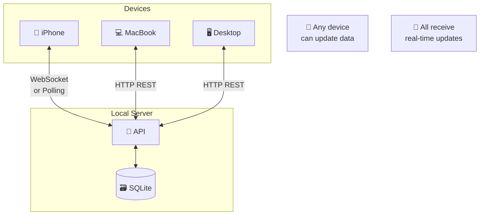

---

## 💻 Practical Implementation

### 1. API Project Structure

```
ranking-api/
├── src/
│   ├── controllers/       # HTTP Controllers
│   ├── services/         # Business Logic
│   ├── repositories/     # Data Access
│   ├── models/           # TypeScript Types
│   ├── utils/            # Utilities
│   └── migrations/       # Migration Scripts
├── prisma/
│   └── schema.prisma     # Database Schema
├── backups/              # Automatic Backups
└── package.json
```

### 2. JSON Data Migration Script

```typescript
// Script to migrate data from JSON to SQLite
interface MigrationScript {
  migratePlayersFromJSON(): Promise<void>
  migrateMatchesFromJSON(): Promise<void> 
  calculateInitialRankings(): Promise<void>
  createInitialBackup(): Promise<void>
}
```

### 3. Local Deployment Configuration

```yaml
# docker-compose.yml (optional)
version: '3.8'
services:
  ranking-api:
    build: .
    ports:
      - "3001:3001"
    volumes:
      - ./data:/app/data
      - ./backups:/app/backups
    environment:
      - NODE_ENV=production
      - DATABASE_URL=file:./data/ranking.db
```

---

## 🚀 Implementation Plan

### Phase 1: Preparation (1-2 weeks)
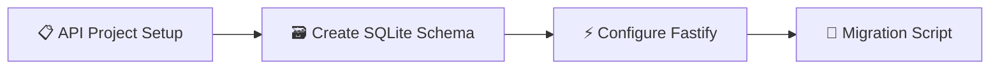

### Phase 2: Core API (2-3 weeks)  
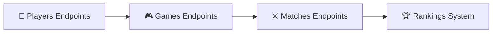

### Phase 3: Updated Client (2-3 weeks)
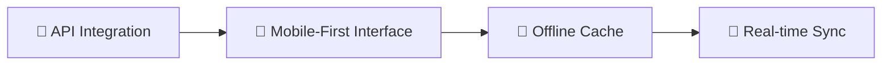

### Phase 4: Deploy and Testing (1 week)
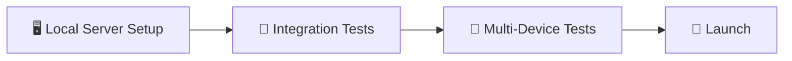

---

## 🔒 Security and Access

### Local Network Access Control

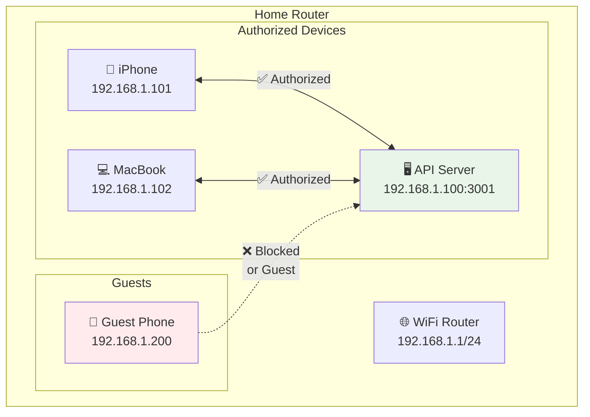

### Authentication Options
1. **IP Whitelist**: Only known devices
2. **JWT Tokens**: User authentication
3. **Guest Mode**: Limited access for visitors

---

## 📈 New Architecture Benefits

### Comparison: Before vs After

| Aspect | JSON Files (Before) | API + SQLite (After) |
|---------|-------------------|--------------------------|
| **Multi-device Access** | ❌ No | ✅ Yes |
| **Synchronization** | ❌ Manual | ✅ Automatic |
| **Performance** | ⚠️ Slow with lots of data | ✅ Fast and optimized |
| **Backup** | ⚠️ Manual | ✅ Automatic |
| **Complex Queries** | ❌ Limited | ✅ Full SQL |
| **Scalability** | ❌ Low | ✅ High |
| **Data Integrity** | ⚠️ Fragile | ✅ ACID Transactions |

---

## 🎯 Next Steps

1. **Validate Concept**: Create a simple prototype
2. **Define Schema**: Model tables in Prisma
3. **Gradual Migration**: Maintain compatibility during transition
4. **Local Testing**: Validate operation on your network
5. **Final Deploy**: Configure dedicated server

---

## 💡 Final Considerations

This architecture combines the **best of both worlds**:
- **Simplicity** of a local solution
- **Scalability** of a professional architecture

The result is a robust, private system totally under your control, prepared to grow as your needs evolve.

---

*📝 Document created to guide the implementation of the local API for the game ranking system*
