# API Local para Sistema de Ranking - Arquitetura e Implementação

## 🎯 Visão Geral da Solução

A ideia consiste em criar uma **API REST local** que roda em um computador dedicado da casa, servindo como servidor central para o sistema de ranking de jogos. Isso permite que múltiplos dispositivos na rede local acessem e sincronizem dados, mantendo a escalabilidade sem depender de serviços externos.

### Principais Benefícios
- ✅ **Privacidade Total**: Dados ficam 100% locais
- ✅ **Sem Custos de Hosting**: Nenhuma mensalidade ou taxa
- ✅ **Performance**: Baixa latência na rede local
- ✅ **Controle Total**: Você administra tudo
- ✅ **Escalável**: Arquitetura permite crescimento futuro
- ✅ **Offline-First**: Funciona mesmo sem internet

---

## 🏗️ Arquitetura do Sistema

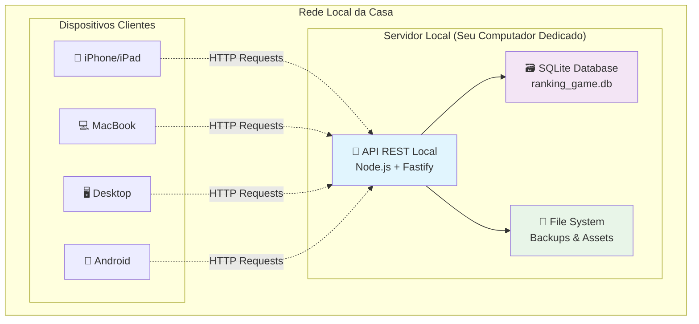

---

## 🔄 Migração dos Dados Atuais

### Estado Atual vs Futuro

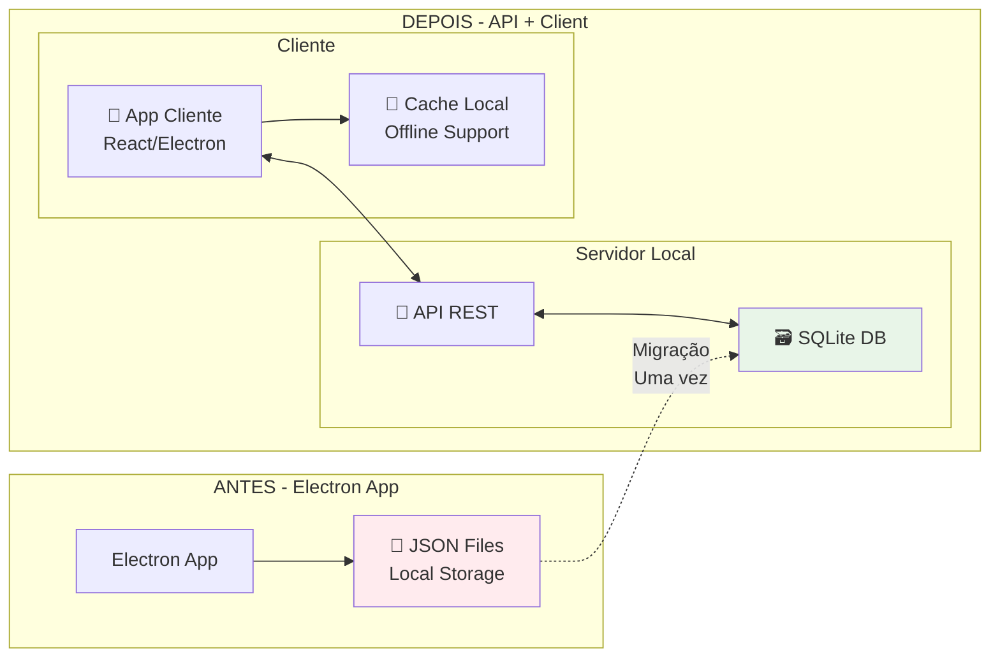

---

## 🗄️ Estrutura do Banco SQLite

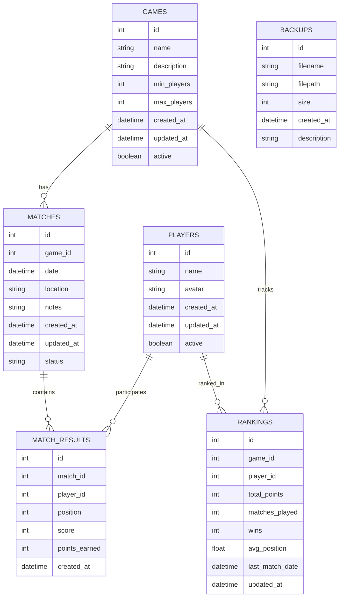

---

## 🛠️ Stack Tecnológica

### Backend (API Local)
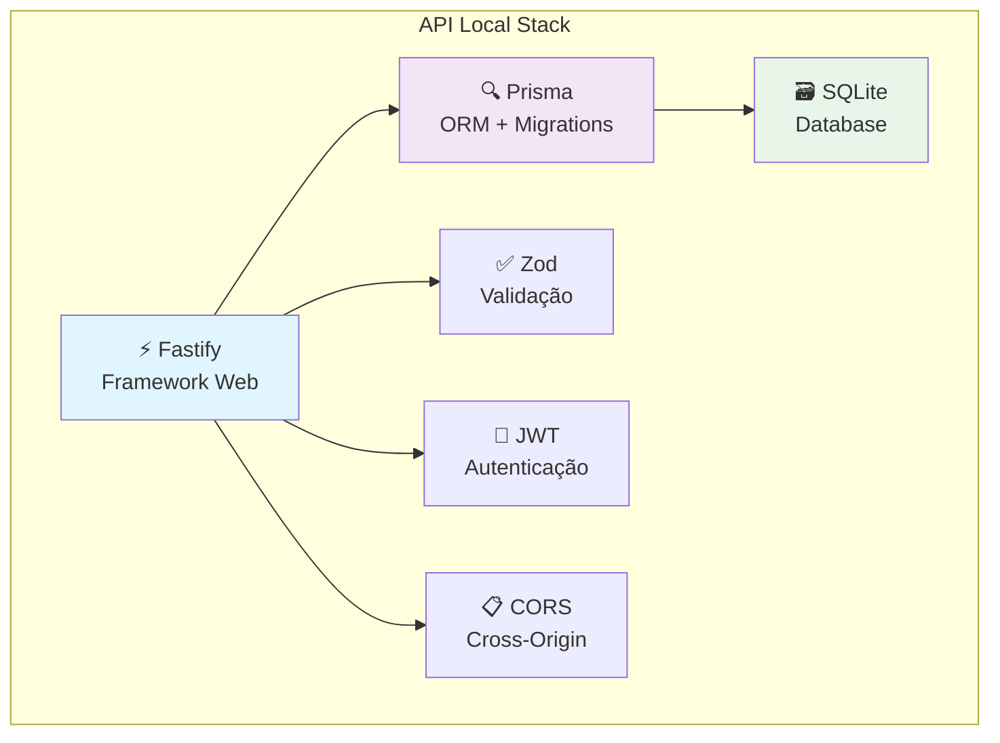

### Frontend (Clientes)
- **Electron App** (Desktop) - Mantém compatibilidade atual
- **PWA/Web App** (Mobile/Tablet) - Acesso via navegador
- **React + TypeScript** - Base comum para ambos

---

## 🌐 Endpoints da API

### Estrutura de Rotas

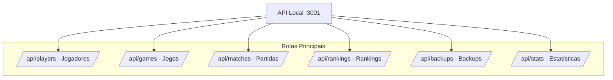

### Exemplos de Endpoints

```typescript
// GET /api/players - Listar jogadores
// POST /api/players - Criar jogador
// PUT /api/players/:id - Atualizar jogador
// DELETE /api/players/:id - Remover jogador

// GET /api/matches - Listar partidas
// POST /api/matches - Registrar nova partida
// GET /api/matches/:id - Detalhes da partida

// GET /api/rankings/:gameId - Ranking por jogo
// GET /api/stats/summary - Estatísticas gerais
```

---

## 🔄 Fluxo de Funcionamento

### Cenário: Registrar Nova Partida

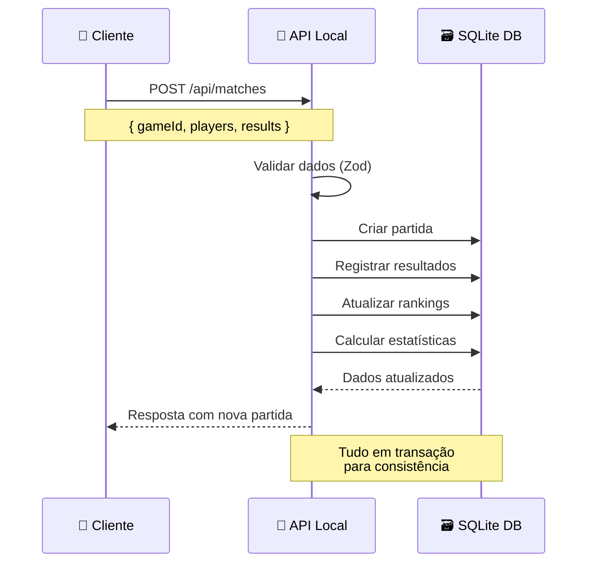

### Sincronização Multi-Dispositivo

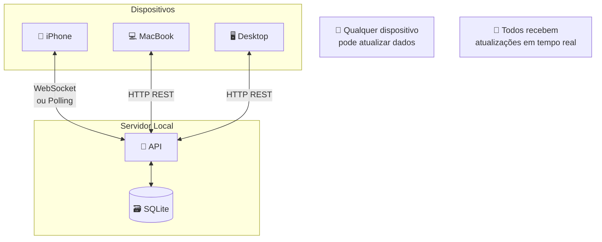

---

## 💻 Implementação Prática

### 1. Estrutura do Projeto API

```
ranking-api/
├── src/
│   ├── controllers/       # Controladores HTTP
│   ├── services/         # Lógica de negócio
│   ├── repositories/     # Acesso aos dados
│   ├── models/           # Tipos TypeScript
│   ├── utils/            # Utilitários
│   └── migrations/       # Scripts de migração
├── prisma/
│   └── schema.prisma     # Schema do banco
├── backups/              # Backups automáticos
└── package.json
```

### 2. Script de Migração dos Dados JSON

```typescript
// Script para migrar dados do JSON para SQLite
interface MigrationScript {
  migratePlayersFromJSON(): Promise<void>
  migrateMatchesFromJSON(): Promise<void> 
  calculateInitialRankings(): Promise<void>
  createInitialBackup(): Promise<void>
}
```

### 3. Configuração de Deploy Local

```yaml
# docker-compose.yml (opcional)
version: '3.8'
services:
  ranking-api:
    build: .
    ports:
      - "3001:3001"
    volumes:
      - ./data:/app/data
      - ./backups:/app/backups
    environment:
      - NODE_ENV=production
      - DATABASE_URL=file:./data/ranking.db
```

---

## 🚀 Plano de Implementação

### Fase 1: Preparação (1-2 semanas)
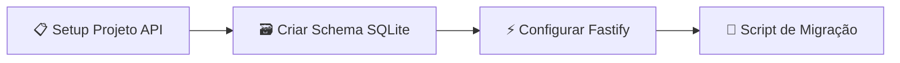

### Fase 2: API Core (2-3 semanas)  
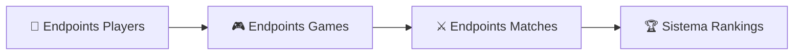

### Fase 3: Cliente Atualizado (2-3 semanas)
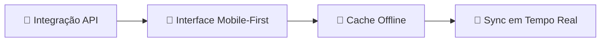

### Fase 4: Deploy e Testes (1 semana)
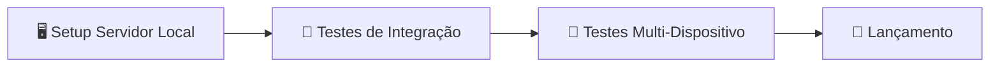

---

## 🔒 Segurança e Acesso

### Controle de Acesso na Rede Local

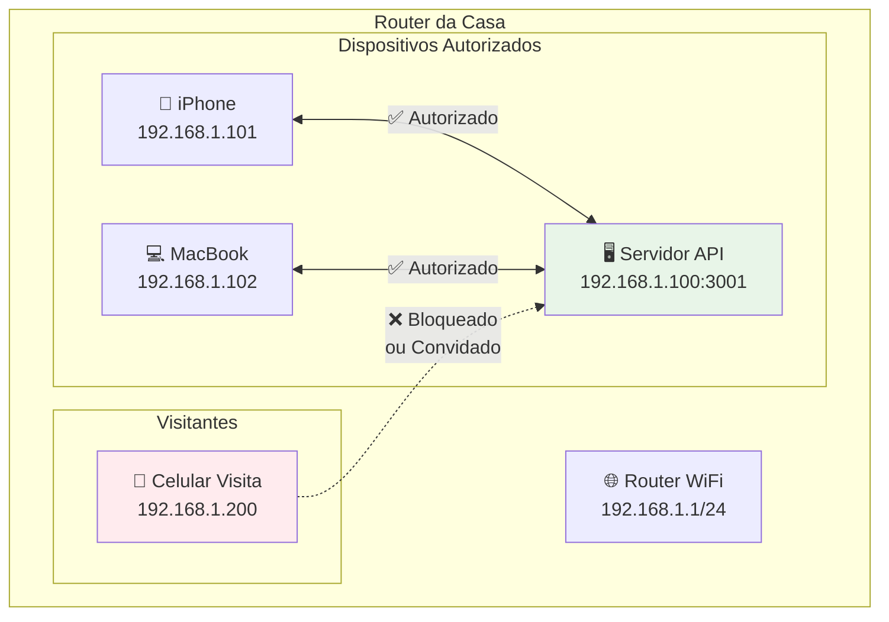

### Opções de Autenticação
1. **IP Whitelist**: Só dispositivos conhecidos
2. **JWT Tokens**: Autenticação por usuário
3. **Guest Mode**: Acesso limitado para visitantes

---

## 📈 Benefícios da Nova Arquitetura

### Comparação: Antes vs Depois

| Aspecto | JSON Files (Antes) | API + SQLite (Depois) |
|---------|-------------------|------------------------|
| **Acesso Multi-dispositivo** | ❌ Não | ✅ Sim |
| **Sincronização** | ❌ Manual | ✅ Automática |
| **Performance** | ⚠️ Lenta com muitos dados | ✅ Rápida e otimizada |
| **Backup** | ⚠️ Manual | ✅ Automático |
| **Consultas Complexas** | ❌ Limitada | ✅ SQL completo |
| **Escalabilidade** | ❌ Baixa | ✅ Alta |
| **Integridade dos Dados** | ⚠️ Frágil | ✅ Transações ACID |

---

## 🎯 Próximos Passos

1. **Validar o Conceito**: Criar um protótipo simples
2. **Definir o Schema**: Modelar as tabelas no Prisma
3. **Migração Gradual**: Manter compatibilidade durante transição
4. **Testes Locais**: Validar funcionamento na sua rede
5. **Deploy Final**: Configurar o servidor dedicado

---

## 💡 Considerações Finais

Esta arquitetura combina o **melhor de dois mundos**:
- **Simplicidade** de uma solução local
- **Escalabilidade** de uma arquitetura profissional

O resultado é um sistema robusto, privado e totalmente sob seu controle, preparado para crescer conforme suas necessidades evoluem.

---

*📝 Documento criado para guiar a implementação da API local do sistema de ranking de jogos*
